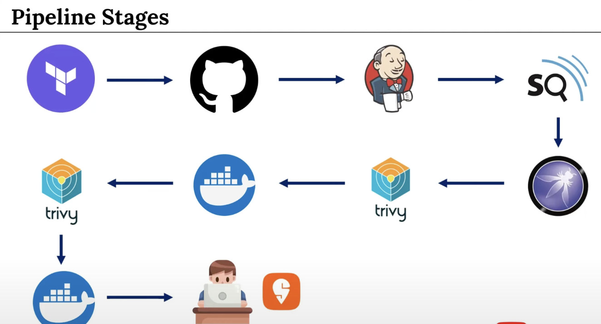

🚀 DevOps Real-time Project: Swiggy Clone App Deployment
In this real-time DevOps project, I demonstrate how to deploy a Swiggy Clone App using various modern tools and services in the DevOps ecosystem.

🛠️ Tools & Services Used:
Terraform 
GitHub 
Jenkins 
SonarQube 
OWASP 
Trivy 
Docker & DockerHub 
📹 Video Link: Click Here
📂 Terraform Script Repository: Terraform Script for Swiggy Clone App
📺 Docker Playlist: Watch on YouTube
About Me
Kastro Profile Image

Kastro
LinkedIn
GitHub

📢 Share Your Experience!
If you've successfully deployed the Swiggy Clone App using this project, I'd love to hear about it!

📹 Post your deployment video and tag me on LinkedIn: Kastro Kiran
💬 Share your experience of deploying the app and the tools you used.

1. This project deploy by using terraform. we have to create ec2 instances and security group using tool terraform. (we are not using at this time)
2. using a tool which is known as terraform now in order to work with the terraform. we need to integrate terraform with an
AWS user and we have to create the AWS configuration. one we do the configuration then we are going to create the infracture by using the terraform tool.
3. Once the infrastructure is created then we are going to use github where our source score of the application is available once the source code of application it's available in the repository then we are going to create the Jenkins in the Jenkins we are going to configure the different tools and the credential that are required to this project once Jenkins set up is completed then we are going to use the code Quality analysis tool which is called as sonar cube by using sonar cube we are going to perform the Quality of the code where we will get to know how many bugs are available how many abilities are available and all other details with respect to the source code of the application once the sonar cube complete the code Quality analysis then we are going to use another tool OASP is a file security scanning tool where it is going to perform the deep levels scanning off the entire code that is available on in the github once this is done then we are also going to use one more tool which is called as trivy. trivy is also a file system scanning tool where it is going to perform the file scan by using the code that is available in github. Once the file assisting scanning is completed then we are going to use the doctor in order to create the docker Image or in order to build the docker image once the Doctor Image is build we will also see how to push the docker Image to the docker hub or to the docker an registry once the docker Image is created then we are going to scan the Doctor image by using trivy here. And once the image is Scan successfully then we are going to push the docker image who is the docker hub and we are going to create Doctor container once the docker container is created then our application Will be deployed successfully into the in the docker container once the application is successfully deployed into the docker container we are going to access the application in the browser once all this stages gets completed then we can see our project is successfully deployed into the doctor container in this project we are focusing on in the inside the docker container and then accessing that Application by using the docker port number. 

### Project Deployment Plan Using Terraform, AWS, Jenkins, SonarQube, OASP, Trivy, and Docker  

## This proect must be focus on deployment the application inside the docker container and then ascessing the application by using docker port number.

---

## Steps
1. we have to create new iam user. we are create access key and secret keys.set up IAM role. in that set up we have to 
configure the aws with inside the code editor. once the configuration is done then we are going to use the terraform 
commands in order to create infrature.-go to iam ---user --- name----iwant to create iam user ---autogenerated ----unselect 
new password to next signup ----- Attach policies directly ---- select AdministratorAccess ---next ---create user ----download
 csv file -----view user ---security creditalshial ---create access key ----cli ---select conform ---next ---create access 
 key--- then open foldrr of terraform script ---- then open terminal --- to configure aws write aws configure --- 
 if error --- then write brew install awscli ---- enterv access key ---- enetr secret key ---install terraform ---- terrafor 
 init --- terraform apply ---- review all correct
2. the login mobaxterm with instance ---- copy ip with jenkins port number ---enter---goto password location --- enter ---copy
 paste ---install suggest plugin --- (aslo access sonarqube with 9000 port number--- default is admin ----) ----jenkins 
 install plugins-- eclipse ,pipeline stage view, SonarQube Scanner, nodejs, OWASP Dependency-Check , docker,Docker Commons,
 Docker Pipeline,Docker API,docker-build-step,--- we have to configure some tools like jdk and owasp --manage jenkins ---tools
  ---add jdk ---name(jdk17) ---install auto --ad installer -- .net ---select java 17 0 11 version ---git install 
  automatically ---add sonarqube ---sonar-scanner(name)---select latest version ---add nodejs---node23(name)--add docker--docker(Name)--- install auto ---docker.com ---add dependency check installation ---add auto -from git hub.com ----apply --save---- go to sonarqube configuration ---adminastration ---security ---users ---select 3 dot token ---name(token)---30days ---generate ---copy token ----go to manage jenkins ---go to credentials --click on global ---add credintial ---kind(secret text) ---paste secret key ---id(Sonar-token) ---Sonar-token(description)--- create sonarqube webhook ---click on sonarqube adminastraction---configuration ---webhook --create- name(jenkins)--paste jenkins url (http://3.109.49.234:8080/sonarqube-webhook/)--- create ---- configure sonarqube url to jenkins ---go to manage jenkins ---systems ---at bottom sonarqube servers ---add sonarqube ---sonar-server(name)--paste it http://3.109.49.234:9000 --- select token ---apply --- then we have to configure docker hub credential--- create account on docker hub ---copy dockerhub username(tejas728) ---manage jenkins----credential --global ----add cred
--- enter uername(tejas728) --give password (Stud@05032002)---id(docker-cred)--- desc(docker)---create
3. then we have to create a job ---jenkins dashboard ---new otem --give name---select pipeline ---paste code --- add 
correct docker hub username in it --- apply ---build

#### **1. Infrastructure Setup with Terraform and AWS**  
- **Terraform-AWS Integration**:  
  - Configure AWS credentials (Access Key and Secret Key) to integrate Terraform with an AWS IAM user.  
  - Define infrastructure-as-code (IaC) using Terraform scripts to provision resources.  
- **Resource Creation**:  
  - Create EC2 instances to host the application and tools (e.g., Jenkins, SonarQube).  
  - Define security groups to manage inbound/outbound traffic rules for the EC2 instances.  
- **Infrastructure Deployment**:  
  - Execute `terraform init`, `terraform plan`, and `terraform apply` to deploy the AWS infrastructure.  

---

#### **2. Source Code Management with GitHub**  
- Store the application’s source code in a GitHub repository.  
- Ensure the repository is accessible for downstream CI/CD pipelines (e.g., Jenkins integration).  

---

#### **3. Jenkins Configuration**  
- **Jenkins Setup**:  
  - Install Jenkins on an EC2 instance.  
  - Install required plugins (e.g., GitHub, Docker, SonarQube Scanner, Trivy).  
- **Credentials Configuration**:  
  - Add AWS, GitHub, Docker Hub, and SonarQube credentials to Jenkins for seamless integration.  
- **Pipeline Design**:  
  - Create a Jenkins pipeline to automate build, test, and deployment stages.  

---

#### **4. Code Quality Analysis with SonarQube**  
- **SonarQube Server Setup**:  
  - Deploy SonarQube on an EC2 instance and configure it for code analysis.  
- **Integration with Jenkins**:  
  - Add SonarQube scanning as a stage in the Jenkins pipeline.  
  - Analyze the GitHub source code to detect bugs, vulnerabilities, code smells, and technical debt.  
  - Generate a report and enforce quality gates (pass/fail criteria).  

---

#### **5. Security Scanning with OASP and Trivy**  
- **OASP Scanning**:  
  - Use OASP (file security scanning tool) to perform deep-level scans of the GitHub repository code.  
  - Identify security vulnerabilities and misconfigurations.  
- **Trivy Filesystem Scan**:  
  - Integrate Trivy into the Jenkins pipeline to scan the repository’s file system.  
  - Detect vulnerabilities in dependencies, configuration files, and secrets.  

---

#### **6. Docker Image Build and Scan**  
- **Docker Image Creation**:  
  - Write a Dockerfile to containerize the application.  
  - Use Jenkins to build the Docker image from the GitHub source code.  
- **Image Scanning**:  
  - Scan the Docker image using Trivy to identify vulnerabilities in the image layers.  
  - Resolve critical issues before proceeding.  
- **Push to Docker Registry**:  
  - Authenticate with Docker Hub/registry via Jenkins.  
  - Push the validated Docker image to the registry for deployment.  

---

#### **7. Docker Container Deployment**  
- **Container Creation**:  
  - Deploy the Docker container from the scanned image on an EC2 instance.  
  - Map the container’s port to the host EC2 instance for external access.  
- **Application Access**:  
  - Validate the application’s functionality by accessing it via the EC2 instance’s public IP and exposed port.  

---

#### **8. Final Validation**  
- Confirm the application runs successfully in the Docker container.  
- Ensure all stages (infrastructure, code quality, security scans, Docker deployment) are completed without errors.  
- Access the application via a web browser using the EC2 instance’s IP and Docker port.  

---

### **Project Outcome**  
The application will be securely deployed in a Docker container on AWS infrastructure, with full automation via Jenkins. Code quality and security checks (SonarQube, OASP, Trivy) ensure robustness, while Terraform and Docker enable scalable and reproducible deployments. 

# Terraform_scripts_swiggy
